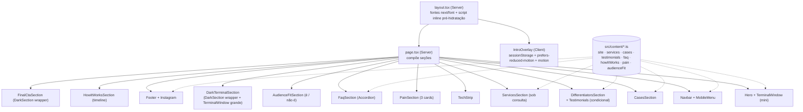

# Landing Page Institucional (Cron Tech) Design

**Spec**: `.specs/features/landing-page/spec.md`
**Context**: `.specs/features/landing-page/context.md`
**Status**: Draft

---

## Architecture Overview

Site 100% estático/SSR (Next.js App Router, sem backend próprio). `page.tsx` (Server Component) compõe as seções na ordem da referência, cada uma alimentada por dados tipados de `src/content/*.ts`. A intro é um overlay client-side independente, montado no layout, que nunca bloqueia a renderização/HTML da home por baixo dele — ver [Approach Exploration](#approach-exploration) para como isso evita flash em visitas repetidas.



---

## Design System (token plan)

**Color** (base da Cron Tech + derivados necessários para contraste AA):

| Token | Hex | Uso |
|---|---|---|
| `--brand-dark` | `#183D2B` | Fundo das seções escuras (terminal, CTA final), sombras |
| `--brand-mid` | `#41A53E` | CTAs primários, links, cor base de interação |
| `--brand-lime` | `#88C729` | Destaques, glow, gradientes, estados ativos |
| `--brand-cream` | `#FAF9E6` | Fundo principal da página |
| `--ink` | `#12261C` (derivado, tingido de verde-escuro) | Texto de corpo sobre creme — evita preto puro, mantém coesão com a marca |
| `--cream-muted` | `#F0EED9` (derivado) | Superfície de cards/bordas sutis sobre o fundo creme, sem depender de sombra |

**Type** (por papel, não por seção):

- **Títulos** (H1–H3, headline do hero, section titles): **Newsreader** (serifada editorial, óptico variável, itálico expressivo) via `next/font/google` — reforça o acento itálico serifado da referência de intro.
- **Corpo/UI** (parágrafos, nav, botões, labels): **Geist Sans** (já instalado) — mantido por decisão do usuário.
- **Terminal/código**: **Geist Mono** (já instalado) — blocos de terminal, prompts, pequenos dados (prazos, datas da timeline).

**Layout**:

- Alinhamento predominantemente à esquerda dentro de um container centralizado (`max-w-*` + padding lateral), não texto centralizado — segue o tom editorial da referência, evita o layout "hero centralizado genérico".
- Ritmo vertical consistente entre seções (escala de `py` única reutilizada), alternando fundo creme/escuro para marcar transições sem precisar de divisores extras.
- Navbar em pill, flutuante com leve blur sobre o hero.
- O "terminal" é o motivo visual recorrente que conecta hero (mini) e o bloco escuro (grande) — evita reintroduzir um motivo novo por seção.

**Motion principles**:

- Um único momento **orquestrado**: a sequência de intro (logo + typewriter + transição). Continua sendo o ponto alto de movimento da página.
- A digitação estilo terminal é a assinatura de movimento recorrente (hero + bloco escuro) — motivada pelo conteúdo (demonstra o produto), não decorativa.
- Reveal de scroll **discreto e utilitário** (não um segundo "momento"), restrito a seções abaixo da dobra: fade + translate curto (≤16px, ~0.4s), uma vez por elemento, via `whileInView` (AD-004). Hero, navbar e conteúdo acima da dobra nunca animam por scroll — protege o LCP.
- Fora da intro/terminal/reveal de scroll: sem fade-slide-up adicional. Interação limitada a hover/focus (ex.: leve elevação/realce em cards e CTAs) e ao accordion do FAQ.
- `prefers-reduced-motion: reduce` desliga intro, digitação e reveal de scroll em qualquer lugar (renderiza o estado final estático direto).

**Principles (o que evita o "genérico")**:

- Sem badges numerados (01/02/03) exceto na timeline "Como funciona", que é de fato sequencial — cards de dor/serviços não recebem numeração.
- Sem eyebrow label em caixa alta/tracked; quando uma seção precisa de um rótulo curto, ele usa a mono em caixa normal com um glifo de prompt (`$`/`>`), reforçando o motivo "terminal" em vez de decoração genérica.
- Cards de conteúdo (dor, serviços, casos) não usam o kit "card SaaS" padrão (mesmo raio em tudo + sombra cinza suave idêntica); ver Tech Decisions.
- Pills reservadas para navbar e CTAs (motivo consistente da referência); terminal windows usam raio pequeno/zero (evocando chrome real de terminal).

---

## Approach Exploration

Três decisões arquiteturais com alternativas reais foram confirmadas com o usuário antes de detalhar os componentes:

### 1. Prevenção de flash na intro (SSR home + overlay client)

- **Recomendada e escolhida**: script inline mínimo em `layout.tsx`, executado antes da primeira pintura (antes da hidratação React), que lê o `sessionStorage` **e** checa `window.matchMedia("(prefers-reduced-motion: reduce)")`; se a sessão já viu a intro OU reduced-motion está ativo, marca `<html data-intro="skip">`, senão `<html data-intro="show">`. `IntroOverlay` (client) lê esse mesmo estado ao montar. A home já está no HTML (SSR) independente do valor — o script só controla se a *camada de overlay* aparece.
- **Defesa em profundidade (CSS-first, não só JS-first)**: o overlay é **oculto por padrão via CSS** (ex.: `[data-intro] .intro-overlay { display: none }` só vira visível sob `html[data-intro="show"] .intro-overlay`). Isso significa que sem JavaScript (script inline não roda, `data-intro` nunca é escrito) o overlay **nunca aparece** — a home renderizada no servidor é o único conteúdo visível, sem depender de o script ter rodado com sucesso.
- **`<html suppressHydrationWarning>`**: necessário porque o script inline escreve o atributo `data-intro` no `<html>` antes do React hidratar; sem essa flag, o React acusaria mismatch entre o HTML gerado no servidor (sem o atributo) e o DOM já alterado pelo script no cliente.
- **Alternativa descartada**: overlay 100% client-side (`useEffect` decide depois do primeiro paint) — mais simples, mas risco de flash em hidratação lenta.
- **Registrado em**: `.specs/STATE.md` `AD-001`.

### 2. Seções de fundo escuro dentro de uma página majoritariamente clara

- **Recomendada e escolhida**: wrapper `DarkSection` que sobrescreve os tokens `--background/--foreground/--card/...` (mesmo mecanismo que o preset shadcn já usa para `.dark`, mas escopado ao wrapper da seção, não ao tema do SO/usuário) com os verdes da Cron Tech. Todo componente existente que já usa `bg-background`/`text-foreground` funciona sem mudança dentro da seção.
- **Alternativa descartada**: sistema de tokens paralelo (`.section-dark` com variáveis próprias) — mais isolado, porém duplica semântica e exige que cada componente saiba explicitamente em qual "modo" está.
- **Registrado em**: `.specs/STATE.md` `AD-002`.

### 3. Direção tipográfica

- **Recomendada**: trocar título/corpo/mono (Fraunces + Manrope + JetBrains Mono).
- **Escolhida pelo usuário**: trocar **só os títulos** por uma serifada editorial (Newsreader), mantendo Geist Sans/Geist Mono (já instalados) no corpo e no terminal — menor esforço/risco agora.
- **Registrado em**: `.specs/STATE.md` `AD-003`.

### 4. Reveal de scroll em seções abaixo da dobra

- **Decisão do usuário** (ajusta o princípio de motion original, que era "nenhuma animação de entrada por scroll"): fade + translate curto (≤16px, ~0.4s), uma única vez por elemento, via `motion` `whileInView`, aplicado **só** a seções abaixo da dobra.
- Hero, navbar e qualquer conteúdo acima da dobra **não** animam por scroll — protege o LCP (a primeira pintura nunca depende de uma animação de entrada terminar).
- Desligado inteiramente com `prefers-reduced-motion: reduce` (renderiza no estado final, sem transição).
- **Registrado em**: `.specs/STATE.md` `AD-004` (supersede parcial do princípio de motion original — o "único momento orquestrado" continua sendo a intro/terminal; o reveal de scroll é um efeito de entrada discreto e utilitário, não um segundo "momento", e fica restrito ao conteúdo abaixo da dobra).

---

## Code Reuse Analysis

### Existing Components to Leverage

| Component | Location | How to Use |
|---|---|---|
| Button (shadcn) | `src/components/ui/button.tsx` | Base de todo CTA (hero, serviços, CTA final, nav) |
| `cn()` helper | `src/lib/utils.ts` | Merge condicional de classes em todos os componentes novos |
| Tema Tailwind/shadcn (tokens `--background`, `--foreground`, `--primary`...) | `src/app/globals.css` | Reescrever os *valores* dos tokens com a paleta Cron Tech; manter os *nomes* para reaproveitar utilitários e o mecanismo de `DarkSection` (AD-002) |
| `motion` (Framer Motion) | já em `package.json` | Intro (logo/typewriter) e `TerminalWindow` (digitação); nenhuma lib de animação nova |
| `lucide-react` | já em `package.json` | Ícones (menu, chevron do accordion, Instagram, seta de "ver demo") |
| shadcn CLI (preset Nova) | `components.json` | Adicionar `accordion` (FAQ) e `sheet` (menu mobile) nesta feature |

### Não utilizado nesta feature (registrar para não confundir Tasks)

| Dependência instalada | Por que não é usada aqui |
|---|---|
| `react-hook-form` + `zod` | Contato é WhatsApp-only (decisão do usuário em `context.md`); sem formulário nesta feature |

### Integration Points

| System | Integration Method |
|---|---|
| WhatsApp | Link `wa.me/<numero>?text=<mensagem>` gerado por um helper único, sem API/backend |
| Google Fonts (Newsreader) | `next/font/google`, mesma técnica já usada para Geist |
| Instagram | Link estático `<a>` no footer, sem SDK/API |

---

## Components

### `IntroOverlay`
- **Purpose**: Reproduz a intro (logo + typewriter "Cron Tech" + transição), decide se deve aparecer, e sai de cena sem deixar rastro na árvore de acessibilidade.
- **Location**: `src/components/intro/intro-overlay.tsx` (client)
- **Props**: nenhuma (lê `sessionStorage`/`matchMedia` internamente)
- **Dependencies**: `motion`; atributo `data-intro="show"|"skip"` setado pelo script inline do `layout.tsx` (que também checa `prefers-reduced-motion`); oculto por padrão via CSS (só visível sob `html[data-intro="show"]`), portanto nunca aparece sem JS
- **Reuses**: `TerminalWindow`/tipografia de título para o "Cron Tech" digitado (mesma fonte Newsreader itálica)

### `Navbar` + `MobileMenu`
- **Purpose**: Navegação pill fixa; colapsa para um `Sheet` acessível em mobile.
- **Location**: `src/components/layout/navbar.tsx` (server) + `mobile-menu.tsx` (client)
- **Props**: `links: { label: string; href: string }[]` (de `site.ts`)
- **Reuses**: shadcn `Sheet`, `Button`

### `TerminalWindow`
- **Purpose**: Card de terminal reutilizável (chrome de janela + linhas de conteúdo), com variante estática e variante com digitação.
- **Location**: `src/components/ui/terminal-window.tsx`
- **Props**: `lines: string[]`, `animated?: boolean`, `className?: string`
- **Dependencies**: `motion` quando `animated`; respeita `prefers-reduced-motion` internamente (força estado final estático)
- **Reuses**: token `--font-mono` (Geist Mono)

### `DarkSection`
- **Purpose**: Wrapper que escopa os tokens de tema escuro (AD-002) para o conteúdo interno.
- **Location**: `src/components/layout/dark-section.tsx`
- **Props**: `children`, `className?`
- **Reuses**: mecanismo de tokens do shadcn (`--background`/`--foreground` etc.), só que escopado

### Seções de conteúdo (todas Server Components, sem estado)
`Hero`, `TechStrip`, `PainSection`, `AudienceFitSection`, `DarkTerminalSection`, `DifferentiatorsSection`, `CasesSection`, `ServicesSection`, `HowItWorksSection`, `Footer`
- **Location**: `src/components/sections/*.tsx` (+ `src/components/layout/footer.tsx`)
- **Props**: recebem os dados já tipados de `src/content/*.ts` (import direto, sem fetch)
- **Reuses**: `Button`, `DarkSection` (nas duas que são escuras), `TerminalWindow` (Hero e DarkTerminalSection)

### `FaqSection`
- **Purpose**: Accordion de perguntas frequentes, um item aberto por vez.
- **Location**: `src/components/sections/faq.tsx` (client, por causa do estado do Radix Accordion)
- **Dependencies**: shadcn `Accordion` (`type="single" collapsible"`) — satisfaz LP-06 AC2 diretamente via prop do Radix, sem estado manual

### `buildWhatsAppLink`
- **Purpose**: Único ponto que monta URLs `wa.me` a partir do número central e de uma mensagem contextual.
- **Location**: `src/lib/whatsapp.ts`
- **Interfaces**:
  - `buildWhatsAppLink(message?: string): string` — retorna a URL completa `https://wa.me/5531984503647?text=...` (mensagem default quando omitida)
- **Dependencies**: `src/content/site.ts` (`whatsappNumber`)
- **Reuses**: nenhum (é a base reutilizada por todos os CTAs)

---

## Data Models

### `src/content/site.ts`

```typescript
interface SiteConfig {
  whatsappNumber: string       // "5531984503647" (E.164, sem símbolos)
  whatsappDisplay: string      // "+55 31 98450-3647"
  instagramUrl: string         // "https://www.instagram.com/cron_tech/"
  productionUrl: string        // TODO: domínio de produção (placeholder até definição)
  navLinks: { label: string; href: string }[]
}
```

### `src/content/services.ts`

```typescript
interface Service {
  id: string
  name: string                 // "Sites e Landing Pages" etc.
  description: string
  timeframe: string            // "X a Y dias úteis" — indicativo, nunca preço
  whatsappMessage: string      // mensagem pré-preenchida específica do serviço
  hasShowcaseCases: boolean    // true só para "Sites e Landing Pages"
}
```

### `src/content/cases.ts`

```typescript
interface Case {
  id: string
  name: string                 // "Performance Motion" etc.
  description: string
  demoUrl: string               // URL real, obrigatória (só existem os 3 reais)
  imageSrc: string               // "/cases/performance-motion.png" etc. (nome real em disco)
  imageAlt: string
}
```

**Relationships**: só os `Case` reais de Sites/LPs existem como itens; os demais 4 serviços não têm `Case` — a `CasesSection` renderiza os exemplos ilustrativos desses serviços a partir de `services.ts` (texto), não de `cases.ts`.

### `src/content/testimonials.ts`

```typescript
interface Testimonial {
  quote: string
  author: string
  role?: string
}

// Array vazio por padrão -> DifferentiatorsSection não renderiza o bloco (LP-03 AC5/6)
```

### `src/content/faq.ts`, `howItWorks.ts`, `pain.ts`, `audienceFit.ts`

```typescript
interface FaqItem { question: string; answer: string }
interface HowItWorksStep { title: string; description: string }
interface PainPoint { title: string; description: string }
interface AudienceFit { fitFor: string[]; notFitFor: string[] }
```

---

## Error Handling Strategy

| Error Scenario | Handling | User Impact |
|---|---|---|
| `testimonials.ts` sem itens | `DifferentiatorsSection` não renderiza o bloco de depoimentos (checagem de `array.length`) | Seção de diferenciais aparece completa, sem espaço vazio |
| `prefers-reduced-motion: reduce` | `IntroOverlay`/`TerminalWindow` pulam direto para o estado final, sem frames de animação | Home aparece imediatamente, sem movimento |
| JavaScript desabilitado | Script inline nunca roda → `data-intro` nunca é escrito; overlay é oculto por padrão via CSS (não depende do JS ter rodado); home (SSR) já está no HTML e é exibida normalmente | Visitante vê a home direto, sem intro, sem flash de overlay |
| Clique em link externo (demo/WhatsApp/Instagram) bloqueado por pop-up blocker | `<a target="_blank" rel="noopener noreferrer">` com `href` real — navega mesmo sem `window.open` | Link sempre funciona como navegação normal |
| Domínio de produção ainda é o placeholder `TODO` | Metadata/Open Graph usam o placeholder sem quebrar a build | SEO/OG funcionam com URL provisória até o domínio real ser definido |

---

## Risks & Concerns

| Concern | Location (file:line) | Impact | Mitigation |
|---|---|---|---|
| Tema atual é o padrão neutro do shadcn (grays), título ainda é "Create Next App" | `src/app/globals.css:51-118`, `src/app/layout.tsx:15-18` | Nada reflete a marca Cron Tech ainda | Task de fundação reescreve tokens (paleta) + `next/font` (Newsreader) + `metadata` reais |
| Só o `Button` existe em `src/components/ui` | `src/components/ui/button.tsx` | `Accordion`/`Sheet` não estão disponíveis para FAQ/menu mobile | Task de fundação roda `shadcn add accordion sheet` antes das seções que dependem deles |
| Logo é um PNG de ~1 MB | `public/brand/logo-crontech.png` (1.059.520 bytes) | Pesa no LCP logo na primeira pintura (usado na intro, o primeiro conteúdo visível) | Task dedicada: redimensionar/gerar WebP em tamanhos apropriados para intro e navbar, servir via `next/image` |
| Acessibilidade do accordion/menu mobile depende de primitives Radix ainda não adicionadas | N/A (a adicionar) | Risco de não atender LP-07 AC5 (teclado/foco) se implementado à mão | Usar `Accordion`/`Sheet` do shadcn (Radix por baixo, já acessíveis por padrão) em vez de construir do zero |

---

## Tech Decisions

| Decision | Choice | Rationale |
|---|---|---|
| Prevenção de flash da intro | Script inline pré-hidratação + atributo em `<html>` | AD-001 — home nunca bloqueada, sem flash em revisitas/reduced-motion |
| Tema das seções escuras | Wrapper `DarkSection` reaproveitando tokens shadcn escopados | AD-002 — reaproveita todos os componentes/utilitários existentes dentro da seção |
| Tipografia | Newsreader só nos títulos; Geist Sans/Mono mantidos | AD-003 — decisão do usuário: menor esforço agora, ainda distintivo nos títulos |
| Biblioteca de animação | `motion` (já instalada), só na intro e no `TerminalWindow` | Evita nova dependência; motion não-decorativa em todo o resto, por diretriz do frontend-design |
| Menu mobile | shadcn `Sheet` (Radix Dialog) | Foco/teclado/`Esc` corretos "de fábrica" |
| FAQ | shadcn `Accordion` `type="single" collapsible` | Satisfaz "um aberto por vez" (LP-06 AC2) via prop, sem estado manual |
| Links de WhatsApp | Helper único `buildWhatsAppLink()` lendo `site.ts` | Satisfaz centralização (LP-07 AC9); evita string concatenada espalhada pelos componentes |
| Cards de conteúdo | Divs com estilo próprio, não o `<Card>` padrão do shadcn | Evita o "kit SaaS" (mesmo raio + sombra cinza genérica em tudo) que o brief de design pede para evitar |
| Screenshots dos cases | `next/image` com os arquivos reais de `public/cases/` (`performance-motion.png`, `studio-aureum.png`, `evolution.png`) | Otimização automática de formato/tamanho; evita placeholder — arquivos já fornecidos pelo usuário |
| Reveal de scroll (abaixo da dobra) | `motion` `whileInView`, fade + translate ≤16px, ~0.4s, uma vez, off em reduced-motion | AD-004 — decisão do usuário; mantém hero/navbar livres de animação de entrada (protege LCP) |

> **Decisões de projeto (AD-001 a AD-004) registradas em `.specs/STATE.md`.**
